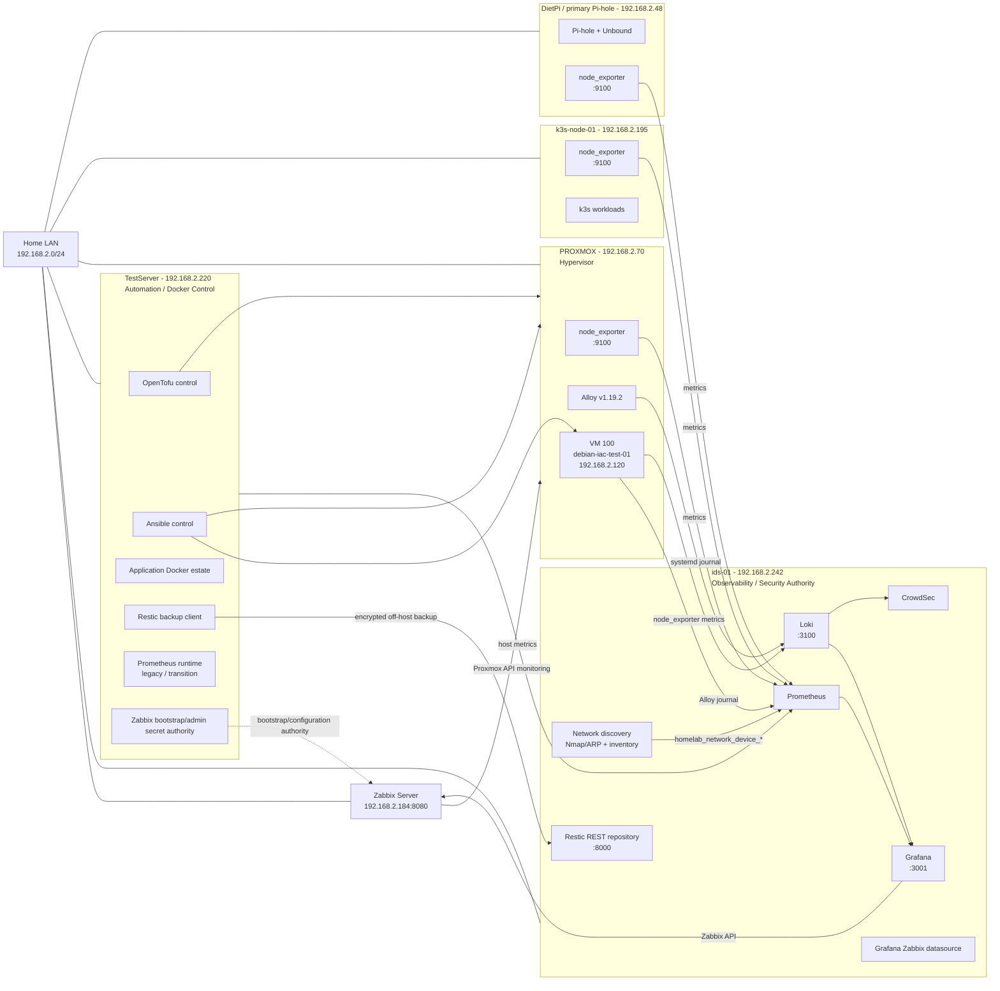

# Homelab Infrastructure Topology

Last verified: **4 September 2026**

This document records where the core homelab services run, where their data is stored, and which host should be treated as the operational authority for monitoring, logging, automation and recovery.

The topology is intentionally split between **current runtime reality** and **intended authority**. Where the two differ, the drift is called out explicitly rather than hidden.

## High-level topology



## Host and service placement

| Host | Address | Primary role | Important services / responsibilities | Data / configuration location | Authority status |
|---|---|---|---|---|---|
| `ids-01` | `192.168.2.242` | Central observability, security and recovery | Grafana, Prometheus, Loki, CrowdSec, network discovery, generated Network Hosts dashboards, Grafana Zabbix plugin/datasource, Restic REST repository, secondary Pi-hole services | Live monitoring runtime under `/home/james/docker`; Git authority under `jrwroberts1976/docker-env` at `hosts/ids-01/stacks/monitoring`; discovery state under `/var/lib/homelab-network-discovery`; Restic repository served from ids-01 | **Observability authority** |
| `TestServer` | `192.168.2.220` | Automation/control node and main Docker application host | OpenTofu, Ansible, application Docker estate, Restic backup client, supporting scripts/collectors; protected Zabbix bootstrap/admin credential source | Git projects under `/home/james/projects`; Docker source checkout under `/home/james/docker`; OpenTofu state under `/home/james/projects/proxmox/tofu`; Zabbix bootstrap/admin secret remains host-local/protected | **IaC/control authority**; Prometheus here is transitional/legacy |
| `Zabbix server` | `192.168.2.184` | Zabbix monitoring server | Zabbix 7.0 API/frontend; host/group/template authority; API endpoint on port `8080`; `Infrastructure/Proxmox` host group | Zabbix server database/configuration; Grafana uses a dedicated read-only API token materialised on ids-01 | **Zabbix monitoring authority** |
| `PROXMOX` | `192.168.2.70` | Hypervisor | Proxmox VE, node_exporter, Alloy v1.19.2, VM hosting; Proxmox API monitoring identity `zabbix@pve!monitoring` | PVE local storage/LVM; `vm-ssd` secondary storage; node_exporter systemd service; Alloy managed from `jrwroberts1976/proxmox` Ansible; monitoring token has protected runtime/SOPS authority on ids-01 | **Hypervisor authority** |
| `debian-iac-test-01` | `192.168.2.120` | Disposable reference VM | QEMU guest agent, node_exporter, Alloy, Debian security patching | Provisioned by OpenTofu and configured by Ansible from `jrwroberts1976/proxmox` | Reference IaC acceptance VM |
| `k3s-node-01` | `192.168.2.195` | Kubernetes node | k3s workloads, node_exporter | Host-local k3s state plus Git-controlled workload sources | Kubernetes workload host |
| `dietpi` | `192.168.2.48` | Primary DNS filtering/resolution | Pi-hole, Unbound, node_exporter | Pi-hole/Unbound host configuration | Primary DNS authority |

## Observability authority

The current architecture is:

```text
Linux / Proxmox hosts
        |
        +--> node_exporter metrics --> ids-01 Prometheus
        |
        +--> Alloy / journals ------> ids-01 Loki
        |                               |
        |                +--------------+-------------+
        |                |                            |
        |                v                            v
        |             Grafana                     CrowdSec
        |                |
        |                +--> Zabbix datasource --> 192.168.2.184:8080
        |                                               |
        +-----------------------------------------------+
                                                        |
                                                Zabbix monitoring
                                                        |
                                                        v
                                                   PROXMOX API
```

`ids-01` is the operational source for Grafana-facing Prometheus metrics and Loki logs. Zabbix remains a separate monitoring authority at `192.168.2.184`, integrated into Grafana through the Zabbix datasource.

### Verified current state

- Grafana runs on `ids-01` in container `grafana` and is exposed on port `3001`.
- Grafana's Prometheus datasource is `http://prometheus:9090`, resolving to the Prometheus container on the ids-01 Docker network.
- Loki runs on `ids-01` and is exposed on port `3100`.
- The Grafana Zabbix datasource points to `http://192.168.2.184:8080/api_jsonrpc.php` and uses the dedicated `grafana-zabbix` API identity.
- The Zabbix API reports version `7.0.30`.
- The `grafana-zabbix` API identity is deliberately restricted: it can see the `Infrastructure/Proxmox`, `Linux servers` and `Zabbix servers` host groups, but has no template-group/template visibility.
- The Zabbix API currently exposes the `Zabbix server` host through that read-only Grafana identity. Proxmox host enrollment remains separate work.
- `PROXMOX` runs `prometheus-node-exporter`, enabled and active on `*:9100`.
- `PROXMOX` is present in the ids-01 Prometheus `linux-hosts` target set as `192.168.2.70:9100` with labels `host="PROXMOX"`, `role="proxmox-host"`, `os="proxmox"`.
- The ids-01 Prometheus API and Grafana Explore both proved `up{job="linux-hosts",host="PROXMOX"} = 1`.
- PROXMOX exposes the CPU, memory and root-filesystem metrics required by the standard host alerts.
- The live Grafana alert set includes `High CPU Usage`, `High Memory Usage`, `Low Disk Space` and `Linux Host Down`; the generic host rules operate on `job="linux-hosts"` and therefore cover PROXMOX.
- `PROXMOX` runs Grafana Alloy v1.19.2, enabled and active, deployed through the Git-controlled Proxmox Ansible configuration.
- Alloy forwards the Proxmox systemd journal to Loki on `ids-01` with `host="PROXMOX"`, `role="proxmox-host"`, `job="systemd-journal"`.
- End-to-end journal ingestion was proved with marker `PROXMOX_ALLOY_TEST_1788157720`, emitted on `PROXMOX` and returned by Loki on `ids-01`.
- A dedicated Proxmox monitoring identity, `zabbix@pve!monitoring`, has `PVEAuditor` at `/`; API calls to `/version`, `/nodes` and `/cluster/resources` have been validated successfully from ids-01.
- The Proxmox monitoring token has been placed into the intended protected SOPS authority structure using `PROXMOX_ZABBIX_TOKEN_ID` and `PROXMOX_ZABBIX_TOKEN_SECRET`; decrypted values are not stored in documentation or shell logs.
- TestServer also has a Prometheus runtime and was able to scrape `PROXMOX`; that path is useful as reachability evidence but is **not** the intended Grafana-facing authority and remains scheduled for later retirement after parity is proven.

## Zabbix control and credential flow

The Zabbix monitoring path is deliberately separated into runtime read access, configuration authority and target credentials:

```text
TestServer protected Zabbix bootstrap/admin credential
                    |
                    v
           Zabbix API configuration
           192.168.2.184:8080
                    |
       +------------+------------------+
       |                               |
       v                               v
Grafana read-only API             Proxmox monitoring
identity                          configuration
`grafana-zabbix`                        |
       |                               v
       v                         `zabbix@pve!monitoring`
ids-01 Grafana                         |
                                       v
                                  PROXMOX API
                                  192.168.2.70:8006
```

Current credential rules:

- The Grafana-to-Zabbix token is a dedicated read-only identity and must not be widened for configuration work.
- The Grafana token runtime file is `/home/james/docker/secrets/zabbix-grafana-api-token` on ids-01; its encrypted recovery/authority source is in `jrwroberts1976/docker-env` under `secrets/ids-01/grafana-zabbix.sops.env`.
- The Proxmox monitoring identity is `zabbix@pve!monitoring`; its secret must never be printed or committed in plaintext.
- The intended encrypted Proxmox monitoring authority is `secrets/ids-01/proxmox-monitoring.sops.env` with keys `PROXMOX_ZABBIX_TOKEN_ID` and `PROXMOX_ZABBIX_TOKEN_SECRET`.
- The Zabbix Super Admin/bootstrap credential is stored protected on TestServer and should be used only to bootstrap/configure a dedicated automation API authority, not as a Grafana runtime credential.
- Token creation/rotation automation must be idempotent and must not regenerate a working token on every run.

## Network discovery and Network Hosts dashboards

Network discovery runs on `ids-01` using Nmap/ARP discovery. It is not dependent on DHCP.

The flow is:

```text
LAN
 |
 v
ids-01 Nmap/ARP discovery
 |
 v
/var/lib/homelab-network-discovery/devices.json
 |
 v
homelab_network_device_info
 |
 v
ids-01 Prometheus
 |
 v
homelab-network-host-dashboards.py
 |
 v
Grafana -> Network Hosts
```

The Proxmox host is present in discovery with:

```text
MAC:      80:E8:2C:1C:55:D2
IP:       192.168.2.70
Hostname: PROXMOX
Vendor:   Hewlett Packard
Online:   1
```

The hostname is enforced through the collector's existing manual-hostname override mechanism, keyed by stable MAC identity. After reconciliation, the generated Grafana dashboard is:

```text
/home/james/docker/data/monitoring/grafana/provisioning/network-hosts-json/generated-hosts/proxmox-1c55d2.json
```

## Proxmox control and recovery path

```text
jrwroberts1976/proxmox Git repository
             |
             +--> TestServer OpenTofu
             |       |
             |       v
             |    PROXMOX API
             |       |
             |       v
             |      VM 100
             |
             +--> TestServer Ansible
                     |
                     +--> PROXMOX host observability
                     |
                     v
                    VM 100
```

A dedicated TestServer SSH identity is used for Proxmox Ansible management:

```text
/home/james/.ssh/proxmox-automation
```

Only the public key is installed on `root@PROXMOX`; the private key remains local to TestServer and is not stored in Git.

OpenTofu state is deliberately local to TestServer and excluded from Git:

```text
/home/james/projects/proxmox/tofu/terraform.tfstate
/home/james/projects/proxmox/tofu/terraform.tfstate.backup
```

Those files are included in the existing TestServer Restic workflow and backed up off-host to the Restic REST repository on ids-01. A controlled restore on 31 August 2026 proved both state files could be restored byte-for-byte identically.

## Backup path

```text
TestServer
 |
 | homelab-backup-testserver.service
 | Restic
 v
https://192.168.2.242:8000/testserver/
 |
 v
ids-01 off-host Restic repository
```

The current proven recovery scope includes OpenTofu state. A full VM 100 backup/restore proof remains separate work.

## Current authority and drift notes

### ids-01 monitoring runtime now has Git authority

The active runtime remains under `/home/james/docker` on ids-01, but that directory is a deployment/runtime location rather than the Git checkout.

The tracked source authority is now:

```text
/home/james/projects/docker-env/hosts/ids-01/stacks/monitoring
```

The corresponding GitHub authority is `jrwroberts1976/docker-env`. It tracks the monitoring Compose definition, Grafana Zabbix datasource/plugin provisioning, protected-secret startup wrapper and deployment helpers. The validated Grafana ↔ Zabbix deployment is therefore no longer an untracked ids-01 configuration gap.

### Grafana alert deployment now has tracked authority

The ids-01 monitoring authority now includes tracked alert payloads and `deploy-grafana-alerts.sh`. The deployment helper preserves the API-managed provenance of the live Grafana rule groups while keeping the canonical payloads in Git.

This replaces the earlier state where generic host rules existed only in the Grafana SQLite database and the repository did not represent the live Host Down semantics.

### TestServer Prometheus is not the intended Grafana authority

TestServer Prometheus can provide useful reachability/parity evidence, but Grafana on ids-01 queries the ids-01 Prometheus container. TestServer Prometheus should therefore remain transitional and should be retired only after all unique jobs/targets have been migrated and parity is proven.

## Service flow summary

| Producer / source | Destination | Protocol / port | Purpose |
|---|---|---:|---|
| Linux hosts / VMs | ids-01 Prometheus | HTTP `9100` scrape targets | Host metrics |
| PROXMOX | ids-01 Prometheus | HTTP `192.168.2.70:9100` | Hypervisor OS metrics |
| PROXMOX Alloy | ids-01 Loki | HTTP `3100` | Proxmox systemd journal |
| Other Alloy agents | ids-01 Loki | HTTP `3100` | Journald/system logs |
| ids-01 network discovery | ids-01 Prometheus | node_exporter textfile metrics | LAN inventory |
| ids-01 Prometheus | Grafana | Docker network `prometheus:9090` | Metrics dashboards/alerts |
| ids-01 Loki | Grafana | Docker network `loki:3100` | Log dashboards/search |
| ids-01 Loki | CrowdSec | Loki source | Security event processing |
| ids-01 Grafana | Zabbix server | HTTP `192.168.2.184:8080/api_jsonrpc.php` | Zabbix datasource/API queries |
| Zabbix server | PROXMOX API | HTTPS `192.168.2.70:8006` | Proxmox platform monitoring after host enrollment |
| TestServer bootstrap authority | Zabbix server | HTTP API `192.168.2.184:8080` | Zabbix automation/configuration bootstrap |
| TestServer OpenTofu | PROXMOX API | HTTPS/API | VM provisioning |
| TestServer Ansible | PROXMOX / managed VMs | SSH | Host/VM configuration management |
| TestServer Restic | ids-01 Restic REST server | HTTPS `8000` | Off-host backup |

## Remaining topology corrections

The remaining corrections required to make runtime match the intended topology are:

1. Complete Proxmox host enrollment into the existing Zabbix `Infrastructure/Proxmox` group using the dedicated `zabbix@pve!monitoring` target credential.
2. Bootstrap a dedicated Zabbix configuration/automation API authority from the protected Super Admin credential on TestServer; do not widen the `grafana-zabbix` runtime identity.
3. Ensure the new `proxmox-monitoring.sops.env` authority is committed through the normal `docker-env` Git workflow once enrollment validation is complete.
4. Restore `debian-iac-test-01` (`192.168.2.120:9100`) to the ids-01 Prometheus target set if it remains absent and the reference VM is still required.
5. Compare TestServer and ids-01 Prometheus jobs/targets, migrate any remaining unique coverage, then retire the TestServer Prometheus instance after parity is proven.

## Related repositories

- `jrwroberts1976/home-lab-docs` — operational documentation and topology.
- `jrwroberts1976/proxmox` — Proxmox/OpenTofu/Ansible authority.
- `jrwroberts1976/docker-env` — TestServer Docker configuration plus ids-01 monitoring/Grafana deployment and encrypted monitoring-secret authority.
- `jrwroberts1976/grafana-alerting` — historical/related Grafana alert-rule source; active ids-01 tracked alert deployment is now also represented under `docker-env/hosts/ids-01/stacks/monitoring`.

## Maintenance rule

Update this topology whenever a service moves host, a new infrastructure host is introduced, an authority changes, or monitoring/logging/backup flow changes materially. The current day's `daily-actions.md` should record the change at the same time.
