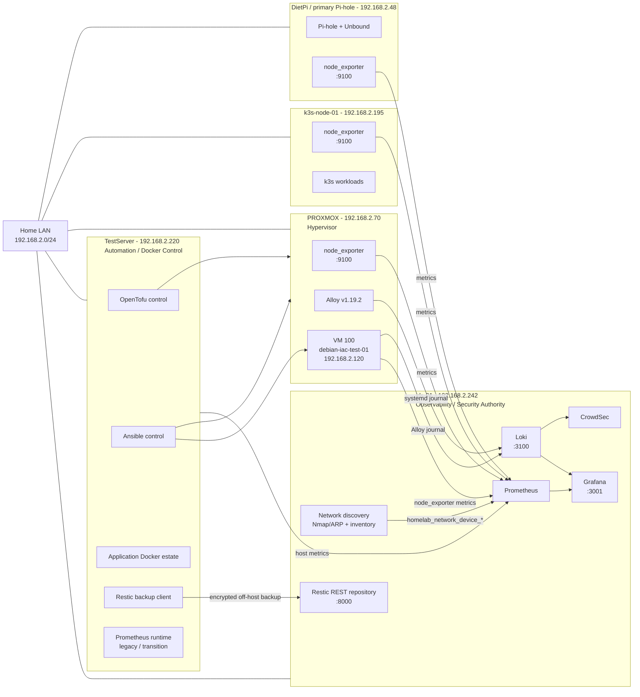

# Homelab Infrastructure Topology

Last verified: **31 August 2026**

This document records where the core homelab services run, where their data is stored, and which host should be treated as the operational authority for monitoring, logging, automation and recovery.

The topology is intentionally split between **current runtime reality** and **intended authority**. Where the two differ, the drift is called out explicitly rather than hidden.

## High-level topology



## Host and service placement

| Host | Address | Primary role | Important services / responsibilities | Data / configuration location | Authority status |
|---|---|---|---|---|---|
| `ids-01` | `192.168.2.242` | Central observability, security and recovery | Grafana, Prometheus, Loki, CrowdSec, network discovery, generated Network Hosts dashboards, Restic REST repository, secondary Pi-hole services | Grafana/Loki/Prometheus runtime under `/home/james/docker/data/monitoring`; discovery state under `/var/lib/homelab-network-discovery`; Restic repository served from ids-01 | **Intended observability authority** |
| `TestServer` | `192.168.2.220` | Automation/control node and main Docker application host | OpenTofu, Ansible, application Docker estate, Restic backup client, supporting scripts/collectors | Git projects under `/home/james/projects`; Docker source checkout under `/home/james/docker`; OpenTofu state under `/home/james/projects/proxmox/tofu` | **IaC/control authority**; Prometheus here is transitional/legacy |
| `PROXMOX` | `192.168.2.70` | Hypervisor | Proxmox VE, node_exporter, Alloy v1.19.2, VM hosting | PVE local storage/LVM; node_exporter systemd service; Alloy managed from `jrwroberts1976/proxmox` Ansible | **Hypervisor authority** |
| `debian-iac-test-01` | `192.168.2.120` | Disposable reference VM | QEMU guest agent, node_exporter, Alloy, Debian security patching | Provisioned by OpenTofu and configured by Ansible from `jrwroberts1976/proxmox` | Reference IaC acceptance VM |
| `k3s-node-01` | `192.168.2.195` | Kubernetes node | k3s workloads, node_exporter | Host-local k3s state plus Git-controlled workload sources | Kubernetes workload host |
| `dietpi` | `192.168.2.48` | Primary DNS filtering/resolution | Pi-hole, Unbound, node_exporter | Pi-hole/Unbound host configuration | Primary DNS authority |

## Observability authority

The desired architecture is:

```text
Linux / Proxmox hosts
        |
        +--> node_exporter metrics --> ids-01 Prometheus
        |
        +--> Alloy / journals ------> ids-01 Loki
                                        |
                         +--------------+-------------+
                         |                            |
                         v                            v
                      Grafana                     CrowdSec
                         |
                         v
                      Alerting
```

`ids-01` should be the single operational source for Grafana-facing metrics and logs.

### Verified current state

- Grafana runs on `ids-01` in container `grafana` and is exposed on port `3001`.
- Grafana's Prometheus datasource is `http://prometheus:9090`, resolving to the Prometheus container on the ids-01 Docker network.
- Loki runs on `ids-01` and is exposed on port `3100`.
- `PROXMOX` runs `prometheus-node-exporter`, enabled and active on `*:9100`.
- `PROXMOX` is present in the ids-01 Prometheus `linux-hosts` target set as `192.168.2.70:9100` with labels `host="PROXMOX"`, `role="proxmox-host"`, `os="proxmox"`.
- The ids-01 Prometheus API and Grafana Explore both proved `up{job="linux-hosts",host="PROXMOX"} = 1`.
- PROXMOX exposes the CPU, memory and root-filesystem metrics required by the standard host alerts.
- The live Grafana alert database contains `High CPU Usage`, `High Memory Usage`, `Low Disk Space` and `Linux Host Down`; all four operate on `job="linux-hosts"` and therefore cover PROXMOX.
- The CPU rule calculates host CPU usage, reduces to the latest value and applies a `> 90` threshold for 10 minutes.
- The live Host Down rule is `up{job="linux-hosts"} == 0`, preserving the failing `host` label.
- `PROXMOX` runs Grafana Alloy v1.19.2, enabled and active, deployed through the Git-controlled Proxmox Ansible configuration.
- Alloy forwards the Proxmox systemd journal to Loki on `ids-01` with `host="PROXMOX"`, `role="proxmox-host"`, `job="systemd-journal"`.
- End-to-end journal ingestion was proved with marker `PROXMOX_ALLOY_TEST_1788157720`, emitted on `PROXMOX` and returned by Loki on `ids-01`.
- TestServer also has a Prometheus runtime and was able to scrape `PROXMOX`; that path is useful as reachability evidence but is **not** the intended Grafana-facing authority and is scheduled for later retirement after parity is proven.

## Network discovery and Network Hosts dashboards

Network discovery runs on `ids-01` using Nmap/ARP discovery. It is not dependent on DHCP.

The flow is:

```text
LAN
 |
 v
ids-01 Nmap/ARP discovery
 |
 v
/var/lib/homelab-network-discovery/devices.json
 |
 v
homelab_network_device_info
 |
 v
ids-01 Prometheus
 |
 v
homelab-network-host-dashboards.py
 |
 v
Grafana -> Network Hosts
```

The Proxmox host is present in discovery with:

```text
MAC:      80:E8:2C:1C:55:D2
IP:       192.168.2.70
Hostname: PROXMOX
Vendor:   Hewlett Packard
Online:   1
```

The hostname is enforced through the collector's existing manual-hostname override mechanism, keyed by stable MAC identity. After reconciliation, the generated Grafana dashboard is:

```text
/home/james/docker/data/monitoring/grafana/provisioning/network-hosts-json/generated-hosts/proxmox-1c55d2.json
```

## Proxmox control and recovery path

```text
jrwroberts1976/proxmox Git repository
             |
             +--> TestServer OpenTofu
             |       |
             |       v
             |    PROXMOX API
             |       |
             |       v
             |      VM 100
             |
             +--> TestServer Ansible
                     |
                     +--> PROXMOX host observability
                     |
                     v
                    VM 100
```

A dedicated TestServer SSH identity is used for Proxmox Ansible management:

```text
/home/james/.ssh/proxmox-automation
```

Only the public key is installed on `root@PROXMOX`; the private key remains local to TestServer and is not stored in Git.

OpenTofu state is deliberately local to TestServer and excluded from Git:

```text
/home/james/projects/proxmox/tofu/terraform.tfstate
/home/james/projects/proxmox/tofu/terraform.tfstate.backup
```

Those files are included in the existing TestServer Restic workflow and backed up off-host to the Restic REST repository on ids-01. A controlled restore on 31 August 2026 proved both state files could be restored byte-for-byte identically.

## Backup path

```text
TestServer
 |
 | homelab-backup-testserver.service
 | Restic
 v
https://192.168.2.242:8000/testserver/
 |
 v
ids-01 off-host Restic repository
```

The current proven recovery scope includes OpenTofu state. A full VM 100 backup/restore proof remains separate work.

## Current authority and drift notes

### ids-01 runtime configuration is not currently a Git checkout

During the 31 August 2026 review:

```text
cd /home/james/docker
git status
```

on ids-01 returned:

```text
fatal: not a git repository
```

This means the active ids-01 Docker/Prometheus runtime configuration is not currently backed by a local Git checkout at `/home/james/docker`.

This is a configuration-authority gap. The live PROXMOX Prometheus target is proven operational, but the ids-01 Prometheus source-of-truth must still be identified or brought under Git control before TestServer Prometheus is retired.

### Grafana alert rules have Git/runtime drift

The mounted Grafana provisioning alert directory currently contains Pi-hole alert files only. The generic host rules are active in Grafana's SQLite database.

The live `Linux Host Down` expression is:

```promql
up{job="linux-hosts"} == 0
```

The current `jrwroberts1976/grafana-alerting` source still contains:

```promql
min(up{job="linux-hosts"}) < 1
```

The live expression has the desired per-host semantics. The repository and deployed state should be reconciled so Git accurately represents the active rule.

### TestServer Prometheus is not the intended Grafana authority

A temporary branch on the TestServer Docker repository added `PROXMOX` to the TestServer Prometheus `linux-hosts.yml` and successfully proved reachability.

However, Grafana on ids-01 queries the ids-01 Prometheus container, not TestServer Prometheus. The temporary TestServer change should therefore not become the long-term monitoring design.

## Service flow summary

| Producer / source | Destination | Protocol / port | Purpose |
|---|---|---:|---|
| Linux hosts / VMs | ids-01 Prometheus | HTTP `9100` scrape targets | Host metrics |
| PROXMOX | ids-01 Prometheus | HTTP `192.168.2.70:9100` | Hypervisor OS metrics |
| PROXMOX Alloy | ids-01 Loki | HTTP `3100` | Proxmox systemd journal |
| Other Alloy agents | ids-01 Loki | HTTP `3100` | Journald/system logs |
| ids-01 network discovery | ids-01 Prometheus | node_exporter textfile metrics | LAN inventory |
| ids-01 Prometheus | Grafana | Docker network `prometheus:9090` | Metrics dashboards/alerts |
| ids-01 Loki | Grafana | Docker network `loki:3100` | Log dashboards/search |
| ids-01 Loki | CrowdSec | Loki source | Security event processing |
| TestServer OpenTofu | PROXMOX API | HTTPS/API | VM provisioning |
| TestServer Ansible | PROXMOX / managed VMs | SSH | Host/VM configuration management |
| TestServer Restic | ids-01 Restic REST server | HTTPS `8000` | Off-host backup |

## Remaining topology corrections

The remaining corrections required to make runtime match the intended topology are:

1. Reconcile Grafana alert-rule Git/runtime drift so `jrwroberts1976/grafana-alerting` represents the live per-host Host Down expression.
2. Restore `debian-iac-test-01` (`192.168.2.120:9100`) to the ids-01 Prometheus target set if it remains absent.
3. Identify or establish Git authority for the active ids-01 Docker/Prometheus configuration.
4. Compare TestServer and ids-01 Prometheus jobs/targets, migrate any remaining unique coverage, then retire the TestServer Prometheus instance after parity is proven.

## Related repositories

- `jrwroberts1976/home-lab-docs` — operational documentation and topology.
- `jrwroberts1976/proxmox` — Proxmox/OpenTofu/Ansible authority.
- `jrwroberts1976/docker-env` — TestServer Docker configuration authority.
- `jrwroberts1976/grafana-alerting` — intended Grafana alert-rule authority; currently requires reconciliation with live Grafana database state.

## Maintenance rule

Update this topology whenever a service moves host, a new infrastructure host is introduced, an authority changes, or monitoring/logging/backup flow changes materially. The current day's `daily-actions.md` should record the change at the same time.
